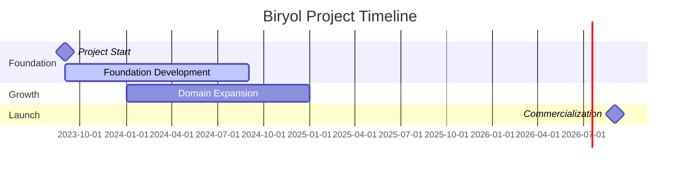

# 🚀 Biryol Project

> A comprehensive overview of the Biryol project development, financials, and timeline

## 📊 Project Overview

| **Metric** | **Details** |
|------------|-------------|
| **Project Name** | Biryol |
| **Start Date** | September 2023 |
| **Target Timeline** | 3 years to commercialization |
| **Status** | Active Development |

## 💰 Financial Summary

### Initial Investment & Spending
| **Period** | **Amount** | **Type** |
|------------|------------|----------|
| **Project Launch** (Sep 2023) | $8,500 | Initial Investment |
| **Year 1 Total** | $7,500 | Development Costs |
| **Hosting & Infrastructure** | $12.60 | Monthly Recurring |

### Monthly Burn Rate
| **Period** | **Monthly Burn** | **Status** |
|------------|------------------|------------|
| **Initial Phase** (Sep-Dec 2023) | $300/month | ⚠️ High Burn |
| **Current Phase** (2024-2025) | $200/month | ✅ Optimized |

### Cost Breakdown
- 🏗️ **Development & Foundation**: $7,500
- ☁️ **Hosting & Infrastructure**: $12.60/month
- 📈 **Career Horizon & Policy**: Variable
- 👥 **Employment & Loyalty Programs**: Included in development costs

## 📅 Project Timeline

## 🎯 Key Milestones

- ✅ **September 2023**: Project foundation started
- ✅ **October 2023**: Initial development phase completed
- 🔄 **2024**: Multiple domain changes and strategic pivots
- 🔄 **Current**: Ongoing development with optimized burn rate
- 🎯 **Target 2026**: Full commercialization

## ⚠️ Risk Assessment

| **Risk Category** | **Impact** | **Mitigation** |
|-------------------|------------|----------------|
| **Financial** | No money guarantee | Monthly burn optimization |
| **Health** | Eye strain, reduced activity | Regular breaks, ergonomic setup |
| **Technical** | Laptop-intensive work | Equipment upgrades, workflow optimization |

## 🏥 Health & Wellness Considerations

> **Important**: Extended development work has identified several health concerns that require attention:

- 👁️ **Eye Health**: Prolonged screen time causing eye strain
- 🪑 **Posture**: Extended sitting periods
- 🏃 **Physical Activity**: Reduced activity levels affecting overall health
- 💻 **Equipment**: Laptop work causing ergonomic issues

### Recommended Actions
- [ ] Implement 20-20-20 rule for eye breaks
- [ ] Set up ergonomic workstation
- [ ] Schedule regular physical activity
- [ ] Consider external monitor for better posture

## 📈 Current Status

| **Aspect** | **Status** | **Next Steps** |
|------------|------------|----------------|
| **Financial Health** | 🟡 Stable | Monitor burn rate |
| **Development** | 🟢 Active | Continue optimization |
| **Timeline** | 🟢 On Track | Maintain 3-year target |
| **Team Health** | 🟡 Attention Needed | Implement wellness measures |

## 🔮 Future Outlook

**Commercialization Target**: 3 years from September 2023 (Target: September 2026)

The project maintains a realistic expectation with **no money guarantee**, focusing on sustainable development and team wellness while working toward the commercialization goal.

---

**Last Updated**: September 16, 2025  
**Document Version**: 1.0  
**Next Review**: Monthly financial assessment
